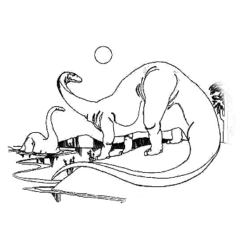

# 001 人到底想要什么（订正）

> Posted by 炉子 on 六 6th, 2011 in 杂论

人总是不知道自己具体要什么，这是因为人们要的其实是超出期望的惊喜。

就好像你很想要某餐厅的某名菜——尽管你没有吃过，或者你想要某名设计师给你做的设计——你们事实上都不知道会做出什么。That’s what you want.——超出你想象上限的东西。你和某人在一起，然后你很开心——以你从未梦想的方式，然后再在一起，再次超出上一次重构过的梦想。然后再在一起，再次超过。然后你就不再关心“自己想要的是什么”这个问题了，你更关心的是他有什么。如同等待一名导演的下一部作品，你会告诉他你想要一部拍成什么样的片子然后要他拍给你看吗？恰恰相反——真的这么做出来的东西你不屑一顾。

你能向人提供那样的体验的话，你不会考虑“谁会要我”或者“我能给出什么”这个问题。你要考虑的就只剩下“什么是爱”了。也不会考虑“你要什么”，人是恒久孤独和恒久饥渴的。这样的东西只要不危害安全，没人不想要——甚至就是危害安全，只要不致命，也是人人想要。甚至就是危害安全，而且致命，只要【现在还不致命】，也仍然是人人想要。【超出想象的美好】，美好两个字甚至可以去掉。

为什么“初恋最美”？因为初恋几乎毫无疑问会超出想象的美好。第二次恋爱，你的想象已经重构了。你经世越久，就对人越是失望。因为你的想象被不断的重构，什么都不构成惊奇了。

那个特别的人的特质在于——他的这种超出想象的美好不是一种制成品，好见人就兜售一番，而是一种半成品，只有你在身边，他才能制成。犹如一位名家只有对着观众才能唱出最后的版本——与那个反复练习的【不同】的版本，一个自己也没有预料和体会过的版本。因此你作为一个特别的观众，同样是他生出超出期望的美好所不能缺少的部分。

若不是你的存在和观看，他也不知道自己能有如此的美好。他同样超出了自己的想象。他已经站在人类想象的边缘，然后他超出了自己的想象，于是他也超出了你的想象。你跟他站在一起，于是你也超出了其他人的想象。人们不但不能想象那惊鸿一唱本身是什么样，同样不能想象【听到那惊鸿一唱】是什么样，你们同时超出了“人类的共同知识领域”。【人想要这个】——到达无人到达的地方，这是一种自由的证明。

人人想要的都是这个，只有在对这个绝望之后，人们才会转向需要安全。实际上“想要安全”，部分的正是想要【等到“那个”的机会】。这是一种挣扎——“那个”总是优先的，但是那个很难得，于是在这个前提下，我要安全，要富足，要XXXXXXX，直到等到“那个”出现。
有的人为了消除这种内在的挣扎，于是对自己说我要的【就是】安全富足，我要“脚踏实地”。他们也对人们这么说，而且是一向的，长期的这么说，这构成了一种“公共舆论”。就是你们看到的那个版本——“我要的是可靠、不花心，其他的普普通通也无所谓”——直到【那个】到来，到达指尖范围之内。为什么“那个”如此无法抗拒？因为“那个”正是【生机】本身。

人的生命是有丰度的，这个是用人的可能性来衡量的。因此人必然受到【更大的可能性】的诱惑，更何况“那个”是【超出想象的美好】，那事实上是在暗示【无限的】可能性，超出你衡量能力的可能性。你在追求生命的宽度和深度，和你追求生命的长度没什么本质的区别。要想抗拒“那个”的诱惑，你要靠【死志】——death wish。持续一生的固定亲密关系，靠的【生于此，亦死于此】的志愿，唯有【死志】才能抵抗那种【生欲】。为什么人人都在等“感觉”才去爱？因为人人都在等一个足以寄托死志的东西，这个东西是什么？就是“那个”。你想要超出想象的美好，你想要这终极的自由的证明，就是这样。

所以你想要一个不断给你带来超出想象的美好的人，不管这到底是多么奢侈的愿望，你就是不能停止想要这个。你就会说，我遇上了足够让我努力奉献一生的人。

这是个事实，你要思考的不是“这个想法是多么不对/不现实”啊。因为那么想没什么用。你是人类，你想活着，你【必然】想要那个，这是没得改变的。随你说它对还是不对，好还是不好，那对“你想要那个”这个命题没有影响，所以你不如另作别的考虑。怎么能得到？得不到怎么办？以为得不到，结果又得到了怎么办？以为得到了，结果不久就停止了，怎么办？那些才是你需要考虑的问题。而不是宣称“我才不想要那个”。凡是如此宣称的人，皆处在一种自相矛盾的状态。等于一个活着而且不想死的人宣称“我才不想活着”。

问题在于：人们想要东西，未必是对人们的长久安全和幸福有好处的东西。如何去控制自己，避免自己在巨大幸福的可能性面前违背健康的原则，避免自己做出疯狂的、毁灭性的举动，避免自己被自己的欲望毁灭，如何学习采用健康的方式实现自己的追求，如何理解健康的方式所能追求到的极限，如何说服自己止步于健康方式所能追求的极限，这才是爱最大的功课。

> 整理：四季
> 定稿：剑寒秋水
